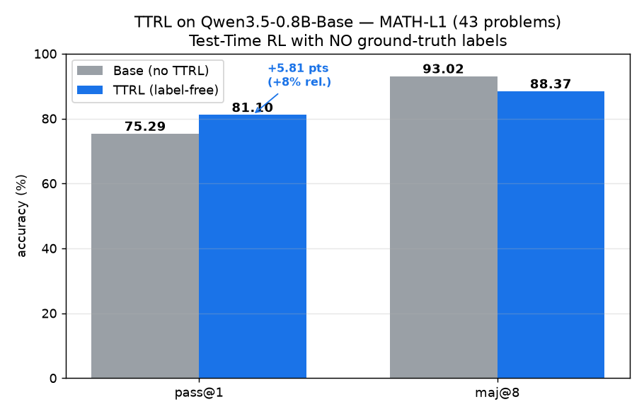
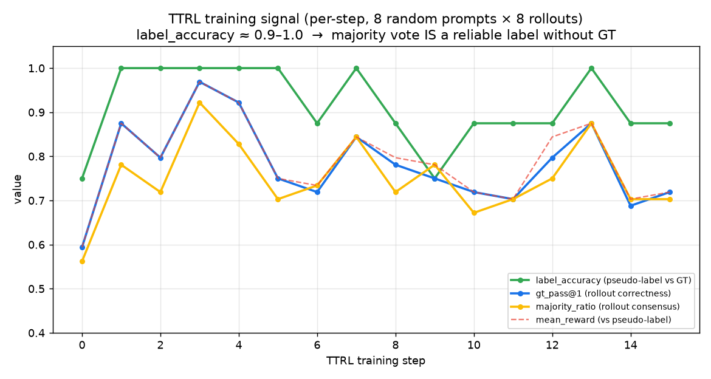
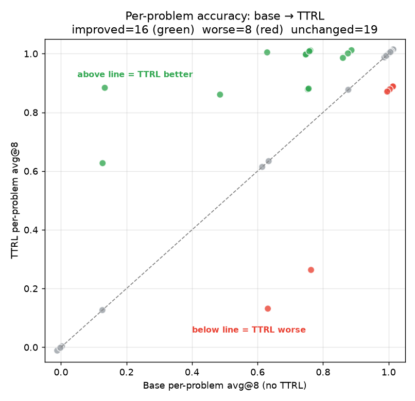

> **Hugging Face writeup (with rendered plots):** https://huggingface.co/OwOpeepeepoopoo/ttrl-qwen3.5-0.8b-math-l1

# TTRL on Qwen3.5-0.8B-Base — a minimal, label-free Test-Time RL reproduction

> **Reproduction of "TTRL: Test-Time Reinforcement Learning" ([arXiv:2504.16084](https://arxiv.org/abs/2504.16084))**
> on a **fresh 2026 base model** (`Qwen/Qwen3.5-0.8B-Base`), trained on **MATH-L1 with NO
> ground-truth labels**, on a **single H100**.

**Code (full, reproducible):** https://github.com/bmjb169-bit/ttrl-2139857f-505bba71-29474ca3

---

## TL;DR — what happened

We took a **brand-new, never-instruction-tuned base model** and improved its math accuracy
**using only its own majority vote as the training signal — zero labels.**

| Method | pass@1 | maj@8 |
|---|---:|---:|
| Base (no TTRL) | 75.29 | 93.02 |
| **TTRL (label-free)** | **81.10** | 88.37 |

**Margin: pass@1 75.29 → 81.10 = +5.81 points (+8% relative), with no ground-truth labels.**



This confirms TTRL's central claim: **a model can teach itself at test time** by treating the
**majority-vote answer over its own rollouts as a pseudo-label** and doing RL (GRPO) against it.

---

## Why this is an interesting reproduction

The paper's results are on `Qwen2.5-Math` models with the authors' `verl`-based stack. We
deliberately did something harder, to add **independent evidence**:

1. **A different, fresher model.** `Qwen/Qwen3.5-0.8B-Base` is a **2026 hybrid
   linear-attention (Mamba/GDN) multimodal** architecture (`qwen3_5`) — *not* what the paper
   used, and *not* supported by the paper's pinned stack (`verl` + `vllm==0.8.5`).
2. **A true base model.** Non-instruct, freshly pretrained — exactly the setting where
   "self-improvement with no labels" is most surprising.
3. **A single GPU, minimal config.** One H100, 43 problems, 16 RL steps, ~1h14m end-to-end.

Getting there required **upgrading the whole inference/training stack** and **bypassing `verl`**
with a compact, self-contained TTRL+GRPO trainer. That journey is documented in
[`PROCESS.md`](PROCESS.md).

---

## The TTRL mechanism (what we reproduced)

TTRL needs **no labels**. For each question it samples several answers, lets them **vote**,
and treats the **majority answer as if it were the correct label** — then does ordinary RL.

```
                         TEST-TIME REINFORCEMENT LEARNING (one step)
                         ============================================

   prompt x  ┌──────────────────────────────────────────────────────────┐
  (a MATH    │                  current policy  πθ                        │
   problem)  └──────────────────────────────────────────────────────────┘
       │                              │ sample G=8 rollouts
       │                              ▼
       │        ┌───────────┬───────────┬───────────┬─── … ──┬───────────┐
       │        │ rollout 1 │ rollout 2 │ rollout 3 │        │ rollout 8 │
       │        │  → "10"   │  → "√51"  │  → "√51"  │        │  → "√51"  │
       │        └───────────┴───────────┴───────────┴─── … ──┴───────────┘
       │                              │ extract \boxed{...} answers
       │                              ▼
       │                   ┌─────────────────────┐
       │                   │   MAJORITY  VOTE     │   ← NO ground-truth used
       │                   │  pseudo-label = "√51"│
       │                   └─────────────────────┘
       │                              │
       │                              ▼
       │            reward rᵢ = 1 if rolloutᵢ == pseudo-label else 0
       │            ┌──────┬──────┬──────┬─── … ──┬──────┐
       │            │  0   │  1   │  1   │        │  1   │
       │            └──────┴──────┴──────┴─── … ──┴──────┘
       │                              │ GRPO: Aᵢ = (rᵢ − mean) / std
       │                              ▼
       └────────────►   maximize  Σ logπθ(aₜ)·Aᵢ   (− KL to ref)   ──►  πθ updated
                                       │
                                       └────────► repeat for next step

   Ground truth is used ONLY to *report* accuracy (label_accuracy / pass@1),
   NEVER to compute the training reward.
```

The bet TTRL makes: **the majority vote of a decent base model is usually right**, so it is a
*good enough* label to reinforce. Our run confirms this directly — see below.

---

## Evidence #1 — the pseudo-labels really are good (label-free signal)

During training we log, per step, how often the **majority-vote pseudo-label matches the
(held-out) ground truth** (`label_accuracy`). It sits at **~0.9–1.0 throughout** — i.e. the
self-generated label is almost always correct. *This is why TTRL works.*



| signal | meaning | trajectory |
|---|---|---|
| `label_accuracy` | majority vote vs. true answer | **0.75 → ~1.0** (mostly 0.875–1.0) |
| `majority_ratio` | how strongly rollouts agree | ~0.56 → ~0.7–0.9 |
| `gt_pass@1` | rollout correctness (per-step, noisy) | jumps off the 0.59 floor immediately |
| `mean_reward` | reward vs. pseudo-label | tracks consensus |

(The per-step `gt_pass@1` is noisy because each step samples 8 *random* prompts at temperature
1.0; the clean before/after measurement is the full 43-problem eval at the top.)

---

## Evidence #2 — per-problem, TTRL helps more than it hurts

Scoring **every one of the 43 problems** before and after with the *identical* evaluator
(HF, n=8, 768 tokens, temp 0.6):



- **16 problems improved**, 8 regressed, 19 unchanged → net **+5.81 pts pass@1**.
- Several problems the base model essentially couldn't do (avg@8 ≈ 0.12) jump to ~0.6–0.9.

---

## Honest scope & limitations

We want to be precise about what this is and isn't:

- ✅ **It is** a faithful, end-to-end, *label-free* reproduction of the TTRL mechanism on a new
  base model, with a real, positive, measured margin.
- ⚠️ **The +8% relative is not the paper's headline ~200% AIME number** — and that's expected.
  MATH-L1 is easy enough that the base is already at **75%** with a **~88–93% maj@8 ceiling**, so
  there's limited headroom. The paper's dramatic gains come from the *weak-but-not-hopeless*
  regime (low pass@1, much higher maj@n). We chose MATH-L1 because a 0.8B model has **no
  consensus on AIME** (we measured AIME pass@1 = 1.67 → no usable signal), making L1 the smallest
  set that still *illustrates the claim*.
- The trainer is a **minimal, single-GPU** implementation (16 steps, 43 problems) meant to
  demonstrate the mechanism cheaply — not to chase a leaderboard number.

The natural next step for a *bigger* margin is a **mid-difficulty tier (MATH-L3/L4)** where base
pass@1 is ~20–40% — the pipeline is ready for it (just change `TASK`).

---

## Files in this repo

| file | what |
|---|---|
| [`README.md`](README.md) | this overview |
| [`PROCESS.md`](PROCESS.md) | the **full story**: every blocker hit and fixed, the stack upgrade, why we bypassed `verl` |
| `images/before_after.png` | base vs TTRL bar chart |
| `images/training_curve.png` | label-free training signal |
| `images/per_problem.png` | per-problem improvement scatter |
| `data/eval_base.json` | baseline eval (per-problem) |
| `data/eval_ttrl.json` | TTRL-trained eval (per-problem) |
| `data/train_log.json` | per-step training metrics |
| `data/EVAL.md` | the run's auto-generated result card |

---

## Reproduce it yourself

Everything is one script on a single H100:

```bash
git clone https://github.com/bmjb169-bit/ttrl-2139857f-505bba71-29474ca3
cd ttrl-2139857f-505bba71-29474ca3
bash run.sh          # install → smoke gate → base eval → TTRL train → trained eval → EVAL.md
```

The run is **staged and fail-fast**: it first proves the (bleeding-edge) stack can serve
`qwen3_5` at all, then measures the baseline, then trains, then re-evaluates — writing an
`EVAL.md` you can read at any point.

**Stack** (auto-installed by `run.sh`): `transformers>=4.57`, **vLLM nightly**
(`0.23.1rc1.dev…`, the first to register `Qwen3_5ForConditionalGeneration`), `math-verify` for
grading. See [`PROCESS.md`](PROCESS.md) for why these exact versions.

---

## Citation

```bibtex
@article{ttrl2025,
  title  = {TTRL: Test-Time Reinforcement Learning},
  journal= {arXiv preprint arXiv:2504.16084},
  year   = {2025},
  url    = {https://arxiv.org/abs/2504.16084}
}
```

Reproduction code: https://github.com/bmjb169-bit/ttrl-2139857f-505bba71-29474ca3
